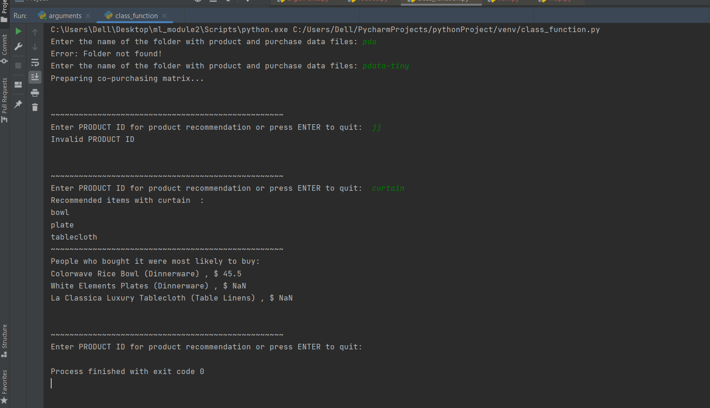

#NUMPY AND PANDAS PROJECT 
This is a program for generating recommendations for someone who has just bought a product, based on which items are often bought together with the product.

The following data has been used:
• A table with product information (prod.csv); product data.
• A table with records of customer purchases of products (purchases.csv);  purchase data.

Two data sets has been used for this assignment, pdata and pdata-tiny. 

Project tasks:
1. Asking the user to specify the subfolder in the current working directory, where the files are stored.

2. Based on the purchase data (purchases.csv), computing the co-purchasing matrix. 

3. Repeating until user requests to terminate the process: asking the user to enter a product that was purchased and using the co-purchasing matrix to determine which product(s) 
to recommend. The recommendation lists all products that have the highest co-purchase value for the user-specified product. 
In case when the user-entered product was not co-purchased with any product (co-purchasing row consists entirely of 0s), 
 program recommends the most popular product(s), i.e. the product(s) that that have been purchased by more customers than any other product.
The display of recommended products uses information from the product data (prod.csv) and follows the format illustrated in the sample interaction.

